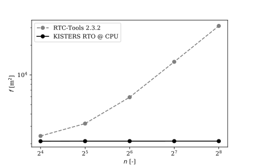
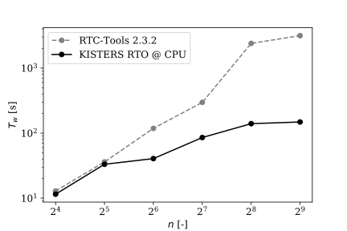

### Introduction

KISTERS RTO and RTC-Tools 2 both use [homotopy continuation](https://arxiv.org/abs/1801.06507) to find optimal
control strategies for non-linear hydraulic systems.  We were curious to see how the two implementations stack up
against each other.

### Technical comparison

We begin by presenting a summary overview comparing the primary characteristics of the two optimization
solutions.  The table covers applications to the real-time optimization of surface water systems modelled using the Saint-Venant equations.

|                                  | RTC-Tools 2.3.3           | KISTERS RTO  |
| -------------------------------- |:--------------|:------|
| Modelling paradigm               | Modelica | KISTERS Network Store |
| Optimization solver              | IPOPT inside continuation loop     |  KISTERS Gorilla |
| Parallelization on CPU | Basic | Extensive (*patent pending*) |
| Parallelization on GPU | No | Optional (*patent pending*) |
| Globally optimal solutions       | No                                      | Yes |
| Globally optimal goal programming          | No                                                                                    |   Yes (*patent pending*) |
| Convergence guarantees           | No (*bound violations resulting in infeasibilities, IPOPT restoration phase failures*) | Yes  |
| Open source   | Yes | No |

### Benchmark setup

We consider a single river reach, with a fixed upstream inflow boundary condition, and an adjustable downstream boundary condition.  Hydraulic and control time steps are fixed at 5 minutes.  The single river reach is discretized using *n* level nodes.  The number of level nodes is varied on a binary scale between 16 and 256 in this benchmark.

The characteristics of the reach and the boundary conditions are identical to those in a [previous benchmark](https://publicwiki.deltares.nl/download/attachments/138543226/Baayen_2019-09-13%20Comparison%20Optimization%20Methods.pdf?version=1&modificationDate=1571401624947&api=v2).

The benchmark problem is single-objective.  The objective is to keep the up- and downstream water levels as close as possible to a reference water level of 0 m above datum.

Solver tolerances were set to identical values (infinity norm of Lagrangian gradient below 10-3).  RTC-Tools was configured to use the [HSL](http://www.hsl.rl.ac.uk/ipopt/) MA57 linear solver.

For every result, three optimizations were run.  RTC-Tools compiles a model into C code and then a shared library on first run, which consumes time.  Therefore, the first optimization run results were discarded.  The reported results are the averages of the second and third runs.

In order to make a fair comparison, GPU acceleration features of RTO / Gorilla were disabled.  The hardware used
was a 2015 Apple MacBook Pro with 2.9 GHz Dual-Core Intel Core i5 CPU and 16 GB of RAM.

### Motivation

This is a simple setup.  It is, however, a subproblem of every more complex surface water problem.  Every surface water problem &mdash; if it is modelled hydraulically &mdash; contains one or more river or canal reaches for which a water level range must be maintained.  Hydro power cascades and canal networks are typical examples of systems that include at least one reach.

Furthermore, a water level range objective is only interesting when it is active, i.e., when violations from a lower or upper level are minimized.  This is the situation that we represent here, in simplified form, when we penalize quadratic deviations from a target water level.  The simplified representation has the advantage that it is independent of the exact implementation of water level range objectives.

For an optimization package to perform well on a more complex problem, it also needs to perform well on its constituent subproblems.  It is for this reason that we consider our simple setup to be the essential benchmark for a hydraulic optimization package.

### Results

If we plot objective function values against the number of water level discretization points, 
we see straight away that RTC-Tools 2.3.3 does *not* find global optima (lower values are better):

This most likely due to the fact that the RTC-Tools Channel Flow [shallow water discretization](https://gitlab.com/deltares/rtc-tools-channel-flow/-/blob/29906a7f7eb76edabd8d3d9b068374dc0de84a55/src/rtctools_channel_flow/modelica/Deltares/ChannelFlow/Hydraulic/Branches/Internal/PartialHomotopic.mo) is not synchronized with the [theory](https://arxiv.org/abs/1801.06507).
Because of this, constraints may become linearly dependent, at which point regularization heuristics are activated in [IPOPT](https://github.com/coin-or/Ipopt).

Secondly, we note that RTO consistently outperforms RTC-Tools 2 in terms of computation time:

For realistic problems, RTO is more than **10 times faster**  than RTC-Tools 2 (note the logarithmic plot axes).   This large difference is mostly due to the use of the KISTERS Gorilla non-convex optimization solver.

### Conclusions

As of this writing, KISTERS RTO outperforms RTC-Tools 2 both in terms of computation time and optimality performance.  The high solution quality coming from RTO is a consequence of a careful implementation of the [path-stable](https://arxiv.org/abs/1801.06507) shallow water discretization.  The high computational performance is largely due to the use of the parallelized KISTERS Gorilla NLP solver.

### Authors

Ties van der Heijden (HKV, PhD candidate at TU Delft) and Jorn Baayen (KISTERS) carried out this benchmark.
